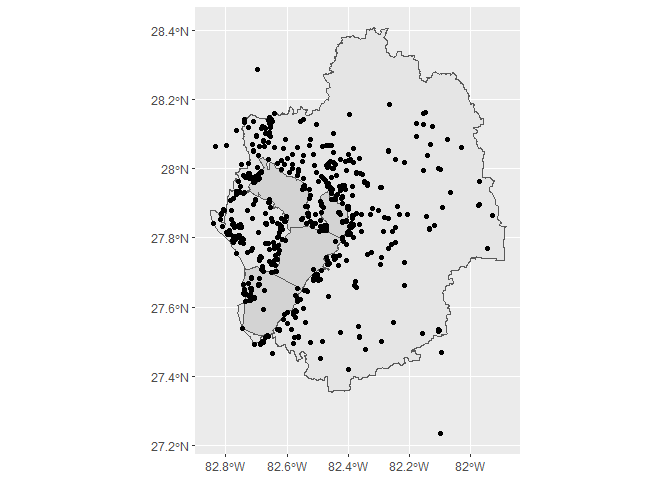

# README

Materials for building an assessment framework for Gulf restoration
effectiveness

``` r
# remotes::install_github('tbep-tech/tbeptools')
library(tbeptools)
library(sf)
library(tidyverse)

data(reststat)
data(restdat)
rest <- reststat %>% 
  full_join(restdat, by = 'id') %>% 
  st_as_sf(coords = c('lon', 'lat'), crs = 4326)

ggplot() + 
  geom_sf(data = tbshed) + 
  geom_sf(data = tbseg, fill = 'lightgrey') + 
  geom_sf(data = rest)
```

<!-- -->
